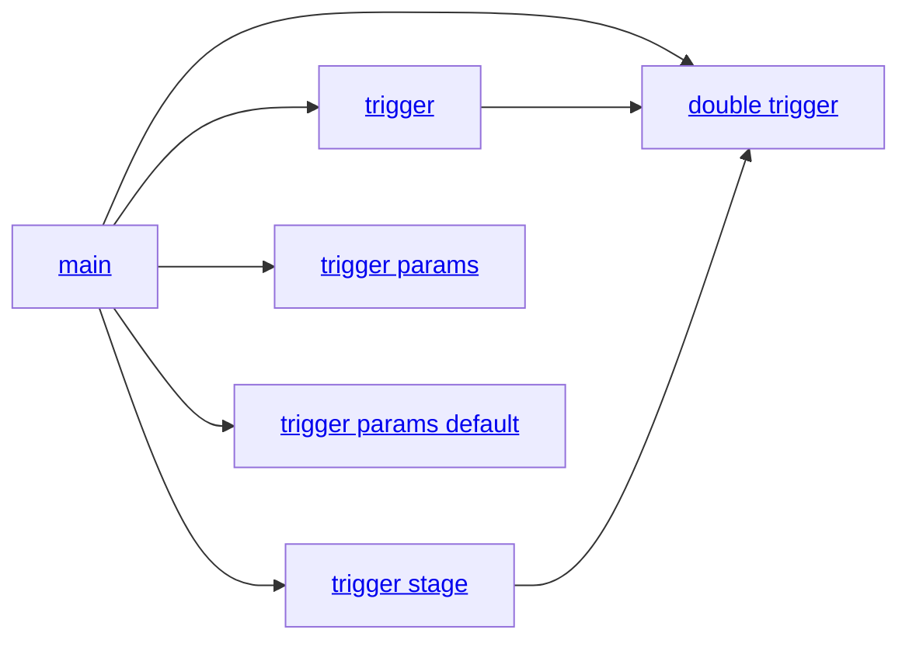

# Azure Pipelines resource triggers

Azure Pipelines resource triggers demo, with examples of [pipeline triggers](https://learn.microsoft.com/en-us/azure/devops/pipelines/process/pipeline-triggers?view=azure-devops&WT.mc_id=DOP-MVP-5001655)

* 